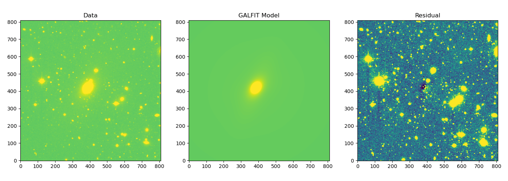
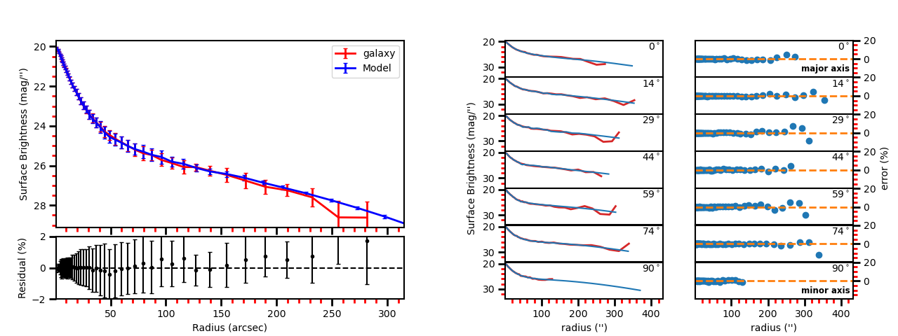

.. contents::
   :depth: 3
..

--------------

**EllipSect**
=============

|DOI|

EllipSect creates surface brightness profiles and extracts other
photometric data from the GALFIT output peng et al. (2002).

This code is “similar” (but not substitute) to IRAF’s ellipse routine. It
creates a Surface brightness profile for the galaxy, model and
, optionally, individual model components.

In addition, *EllipSect* computes variables such as Absolute Magnitude,
luminosity, Flux, total apparent magnitude, Bulge to Total Ratio, Tidal,
Chinu within a radius containing 90% of total light, Bumpiness, Signal to Noise Ratio, Akaike
Information criterion, Bayesian information criterion, mean surface
brightness at effective radius, percentage of total light per component,
radius at 90% of light (for Sersic components only), effective radius in
kpc, etc.

--------------

**Installation**
----------------

The code is written for python 3.

The python libraries required are:

-  numpy
-  astropy
-  scipy
-  matplotlib
-  mgefit

Install GALFIT if you haven't done so.

Download the latest release, and installed it via

::

   cd ellipsect
   pip install . 

or

::

   cd ellipsect
   python setup.py install

Also, you can install it via pip:

::

   pip install EllipSect

Run the automated tests:

::

    tox 

**Note**: *EllipSect* needs the GALFIT output files (GALFIT.XX) to work.
Although *GALFIT* is not stricly required, it will required it to create
the model components and sigma image. Make sure you can call GALFIT from
the command line. Otherwise the automated tests will fail.

--------------

For Linux or Mac, just run ellipsect in the command line:

::

   ellipsect

and that’s it!!

--------------

**HOW TO USE**
~~~~~~~~~~~~~~

**easy run:**
^^^^^^^^^^^^^

Once installed, run *ellipsect* in the same directory that you run
GALFIT. It only requires the latest GALFIT’s output file. *The easiest
way to run the program is:*

::

   ellipsect galfit.01

It will display images like the ones below:

|A85a| |A85b|

for more options:

::

   ellipsect --help 

**Full manual:**
^^^^^^^^^^^^^^^^

To see other options for EllipSect:

`How to use <docs/howto.rst>`__

**Script run:**
^^^^^^^^^^^^^^^

If you want to use EllipSect inside your own python script, you can call
it in the following way:

::

       from ellipsect import ArgParsing 
       from ellipsect import SectorsGalfit

       #put all the argument parsing in a list:
       args=['galfit.01','--logx', '--phot','--noplot']

       parser_args = ArgParsing(args)

       photapi = SectorsGalfit(parser_args)

       print("Akaike Criterion: ",photapi.AICrit)
       print("Bulge to Total: ",photapi.BulgeToTotal)

To check all the output variables besides AICrit and BulgeToTotal,
check:

`Output variables <docs/api.rst>`__

--------------

**Questions?**
--------------

Do you have any questions or suggestions? Please send an email to
canorve [at] gmail [dot] com or open an
`issue <https://github.com/canorve/EllipSect/issues>`__

I’m open to new ideas that can benefit the software *EllipSect* and the
*GALFIT* community

--------------

**License**
-----------

The code is under the license of **GNU**

-----------

**Cite as**
-----------

If you find this code useful, please cite as:

Añorve, Christopher, Ríos-López, Emmanuel, Reyes-Amador, 
Ulises, & López-Cruz, Omar. (2022). canorve/EllipSect: 
EllipSect v2.7.5 (v2.7.5). Zenodo. https://doi.org/10.5281/zenodo.6975592

--------------

**References**
--------------

Akaike, H. (1974). A New Look at the Statistical Model Identification.
IEEE Transactions on Automatic Control, 19, 716–723.

Añorve, C. (2012, July). (PhD thesis). INAOE.

Barden, M., Häußler, B., Peng, C. Y., McIntosh, D. H., & Guo, Y. (2012).
GALAPAGOS: from pixels to parameters, 422(1), 449–468.
doi:10.1111/j.1365-2966.2012.20619.x

Blakeslee, J. P., Holden, B. P., Franx, M., Rosati, P., Bouwens, R. J.,
Demarco, R., Ford, H. C., et al. (2006). Clusters at Half Hubble Time:
Galaxy Structure and Colors in RX J0152.7-1357 and MS 1054-03, 644(1),
30–53. doi:10.1086/503539

Cappellari, M. (2002). Efficient multi-Gaussian expansion of galaxies,
333(2), 400–410. doi:10.1046/j.1365-8711.2002.05412.x

de Vaucouleurs, G. (1948). d’Astrophysique, 11, 247. Recherches sur les
Nebuleuses Extragalactiques.Annales

Häußler, B., Bamford, S. P., Vika, M., Rojas, A. L., Barden, M., Kelvin,
L. S., Alpaslan, M., et al. (2013). MegaMorph - multiwavelength
measurement of galaxy structure: complete Sérsic profile information
from modern surveys, 430(1), 330–369. doi:10.1093/mnras/ sts633

Jedrzejewski, R. I. (1987). CCD surface photometry of elliptical
galaxies - I. Observations, reduction and results., 226, 747–768.
doi:10.1093/mnras/226.4.747

Peng, C. Y., Ho, L. C., Impey, C. D., & Rix, H.-W. (2002). Detailed
Structural Decomposition of Galaxy Images, 124(1), 266–293.
doi:10.1086/340952

Schwarz, G. (1978). Estimating the Dimension of a Model. Annals of
Statistics, 6(2), 461– 464.

Sersic, J. L. (1968). Atlas de Galaxias Australes.

Tal, T., van Dokkum, P. G., Nelan, J., & Bezanson, R. (2009). The
Frequency of Tidal Fea- tures Associated with Nearby Luminous Elliptical
Galaxies From a Statistically Complete Sample, 138(5), 1417–1427.
doi:10.1088/0004-6256/138/5/1417

Vikram, V., Wadadekar, Y., Kembhavi, A. K., & Vijayagovindan, G. V.
(2010). PYMORPH: automated galaxy structural parameter estimation using
PYTHON, 409(4), 1379–1392. doi:10.1111/j.1365-2966.2010.17426.x \__\_

**Other Stuff**
---------------

Check my others GALFIT tools
`here <https://github.com/canorve/GALFITools>`__

--------------

.. |DOI| image:: https://zenodo.org/badge/282223217.svg
   :target: https://zenodo.org/badge/latestdoi/282223217

