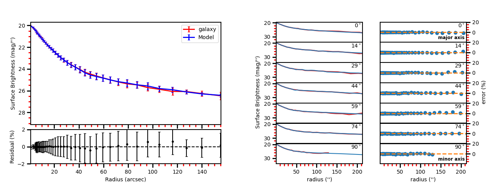
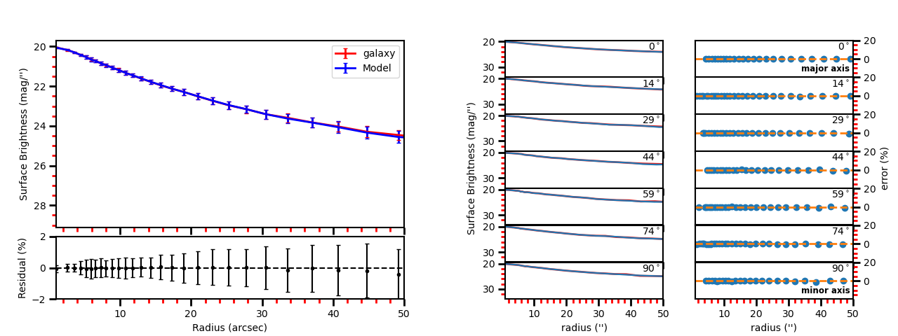

# EllipSectGalfit.py

EllipSectGalfit.py creates surface brightness profiles
for galaxy and galfit model from the galfit output: galfit.XX. 
See peng et al. (2002). It also creates multiple surface brightness 
plots for separate angles.  

**Code: [EllipSectGalfit.py](../EllipSectGalfit.py)**

This is a "quick" substitute for IRAF's ellipse routine. It 
creates a Surface brightness profile for the galaxy and model.

In addition, *EllipSectGalfit* can compute variables such as Absolute Magnitude, 
luminosity, Flux, total apparent magnitude, Bulge to Total Ratio, Tidal, Chinu
in the sectors ellipse, Bumpiness, SNR, AIC, BIC, mean surface brightness,
percentage of total light per component, radius at 90% of light (Sersic component only), effective radius in kpc, etc.  

## Additional Libraries: mgefit

**Install the mgefit library via pip:**  

```
pip install mgefit
```


*The easiest way to run the program is:*

```
 ./EllipSectGalfit.py galfit.01 
```

## OPTIONS

The options to run the code in the terminal (or ipython) are:

```
 ./EllipSectGalfit.py [GALFITOutputFile] [-logx] [-q AxisRatio] [-pa PositionAngle] [-comp] [-pix] [-ranx/y Value] [-grid] [-dpi Value] [-noplot] [-phot] [-sbout] [-noplot] [-minlevel Value] [-sectors Value] [-object Name] [-filter Name] [-snr] [-help] [-checkimg] [-noned] [-distmod Value] [-magcor Value] [-scalekpc Value][-sbdim Value]
 ```

### Input File

**GALFITOutputFile**: GALFIT output file  (e.g. galfit.01)


**help**: Help menu

**logx**: plots X-axis as logarithm

**q**: axis ratio value. If ignored, it takes the one from the last component in GALFITOutputFile.

**pa**: position angle value (same as GALFIT). If ignored, it takes the one 
from the last component in GALFITOutputFile.

**comp**: plots include the individual model components

**pix**: adds pixels units to the top of x-axis.

**ranx**: constant that increase/decrease the range of the x axis *or* 
it can be used as xmin-xmax to change range.

**rany**: constant that increase/decrease the range of the y axis *or* 
it can be used as ymin-ymax to change range.

**noplot**: the code creates images but do not display them.

**grid**: display a grid in the plot

**dpi**: dots per inch value to increase/decrease resolution.

**sbout**: Creates output file containing the surface brightness profiles.


### Photometry output options

**phot**: Compute photometry. Check the variables created in output file.

The below options are used only if 'phot' is enabled:

**snr**: Creates a signal to noise image. This is created dividing the galaxy image
with the sigma image created by GALFIT

**object**: used for 'phot' to search in NED. For instance, if you are looking
for photometry data for galaxy m51, then used as "-object m51" the same name 
that you will used to search in NED.

**filter**: used for 'phot' to indicate band for NED. If you need galactic correction
for B  filter then used as "-filter B". Band "R" is the default option.  

Any of the following options disabled the connection to NED

**noned**: it avoids to connect with NED. No luminosity nor absolute magnitude is computed.

**distmod**: manual input for Distance Modulus.  

**magcor**: manual input for Galactic Extinction. 

**scalekpc**: manual input for equivalence of ''/kiloparsec. 

**sbdim**: manual input for surface brightness dimming.

### Advanced 

**minlevel**: Parameter given directly to sectors_photometry.
              Ellipse radius stops when it founds this value. Check sectors_photometry manual 

**sectors**: parameter given directly to sectors_photometry. Divide ellipse in 'sectors'
                      Check sectors_photometry manual
                     
**checkimg**: save the images used in sectors_photometry for individual components


## Notes

* EllipSectGalfit uses the mask image (option "*F*" GALFIT) only if this
    is a **FITS** image. In case your mask is an *ASCII* file, you can convert it to **FITS** using the [xy2fits.py](xy2fits.md) tool.


* EllipSectGalfit uses axis ratio (*q*) and position angle (*pa*) to create an "ellipse" *grid* using the function *sectors_photometry* from the *mgefit* library. Unlike IRAF's Ellipse, *q* and *pa* are fixed through radius. See the two images below: 

    
    

    For this reason, errors are expected to 
    be greater than those coming from IRAF's ellipse since EllipSectGalfit 
    averages errors for different isophotes. While, on the other hand, IRAF's ellipse
    can change axis ratio and angular position for each isophote. 
    
    This is how mgefit *sectors_photometry* returns the counts data and, unless I write my own code, I can't change that. 

* Be sure to run this code in the same path that you run GALFIT. 

* Since EllipSectGalfit reads the "*B*" option of galfit.XX file, this
    must be the **last** GALFIT fit. 

* The angles shown in the multi-plot are measured from the galaxy's major axis.
    They are **not** measured from the Y-axis. 

* In order for the program to detect the components, they must share the same 
    center (x,y). This allows that galfit can use other components such as
     sersic to be used as masks for nearby GALFIT. EllipSectGalfit already does not 
     take them into account for the plots.

* For the comp option, It could be some small differences between the angle shown 
    in the top right corner and the one from each component. This is because
    *sectors_photometry* is applied different for individual components and the 
    galaxy itself. They are at different angles. To see the real angle which the 
    component is measured check the output file at that angle with the *-sbout* option 

## Examples

* Displays the help menu: 
    ./EllipSectGalfit.py -help


* To manually introduce an axis ratio of 0.35 and position angular of 60 
    (measured from Y-axis): 

     ./EllipSectGalfit.py galfit.02 -q 0.35 -pa 60 

### Plot Examples

See the examples below for an elliptical galaxy that was fitted 
with 7 gaussians (images for this galaxy are displayed above). 

* Simple plot example: 
    ./EllipSectGalfit.py galfit.46 

    
    

* Displays the X-axis as log:
    ./EllipSectGalfit.py galfit.46 -logx

    
    

* Include the individual model components to the plot:  
    ./EllipSectGalfit.py galfit.46 -comp
    (displays the 7 gaussians)

    
    

* Insert pixels units in the top X-axis: 
    ./EllipSectGalfit.py galfit.46 -pix

    
    

* Range in X-axis is decreased 50%: 
    ./EllipSectGalfit.py galfit.46 -ranx 0.5 

    
    

* Range in Y-axis is doubled: 
    ./EllipSectGalfit.py galfit.46 -rany 2 

    
    

* X-axis range vary from 1 to 50: 
    ./EllipSectGalfit.py galfit.46 -ranx 1-50 

    
    

* Use grid on plot and increase resolution to 300 dots per inch: 
    ./EllipSectGalfit.py galfit.46 -grid -dpi 300 

    
    

* Same as above but popup window does not appear. Plots are 
    directly saved in directory: 
 
    ./EllipSectGalfit.py galfit.46 -grid -dpi 300 -noplot 

* If the user desires to create their own plots, 'sbout' option
  will save the surface brightness vs. radius of the galaxy and model
  in a file:
   
    ./EllipSectGalfit.py galfit.46 -sbout

  EllipSectGalfit can also save the surface brightness data for 
  individual components in separated files:

    ./EllipSectGalfit.py galfit.46 -comp -sbout 

### Phot Examples

*   *EllipSectGalfit* can calculate additional info besides the ones 
    that are already included in the galfit.XX or fit.log files.  
    Those variables are intended to help the user to have a quick reference 
    of the model and decide to modify the model or increase the number of components.
    
    Such output variables have to be taken with caution and they always have to be verified for the user before to include them in the final paper.

    The output photometry variables include: Absolute Magnitude, luminosity, Flux, total apparent magnitude, Bulge to Total Ratio, Tidal, $\Chi_\nu$ within the sectors ellipse, Bumpiness, Signal to Noise Ratio, Akaike Information Criterion, Bayesian Information Criterion, mean surface brightness, percentage of total light per individual component, radius at 90% of light ( for Sersic components only). 
    
    Those variable are stored in a single file when the following command is executed:

    ./EllipSectGalfit.py galfit.46 -phot


*   *phot* option looks in NED (NASA/IPAC Extragalactic Database) for 
    Galactic Extinction, distance modulus, surface brightness dimming, etc. 
    to compute Absolute Magnitude, luminosity and other variables. To do this,
    EllipSectGalfit looks for name of the galaxy (as it is searched in NED) 
    and wavelength band in the header. If that info is not in 
    the header, the user can introduce the band and object name as
    it is shown in the next example for galaxy messier 51 in the band B:  


    ./EllipSectGalfit.py galfit.14 -phot -object m51 -filter B

*   If the user wants to see a Signal to Noise image of the data, use 
    the next command:

    ./EllipSectGalfit.py galfit.14 -phot -snr

*   If for some reason the user does not want to connect to NED use 
    the following option:

    ./EllipSectGalfit.py galfit.14 -phot -noned

    take into account that Luminosity and Absolute magnitud will not be computed

*   EllipSectGalfit allows to introduce manually the NED info. For example, 
    the next command introduce a distance modulus of 10, galactic extinction 
    of 0.3, "/kpc of 1.3 and surface brightness dimming of 0.3.  

    ./EllipSectGalfit.py galfit.10 -phot -distmod 10 -magcor 0.3 -scalekpc 1.3 -sbdim .3

    This option avoids to connect with NED. 

    EllipSectGalfit does not correct by K-correction. 


### Advanced Examples

*   The following options requires that the user has already experienced with 
    the *sectors_photometry* function of the mge library. 

    minlevel is a parameter that is given directly to *sectors_photometry* 
    It indicates when the functions stops. For example, the following command
    tells to *sectors_photometry* that stops when the sky is 0.

    ./EllipSectGalfit.py galfit.14 -minlevel 0


    Note: Galfit sky parameter is already removed from image before the call 
    to *sectors_photometry* 


*   sectors option is another parameter that is given directly to *sectors_photometry*.
    It tells the function in how many sectors it should divide. *sectors_photometry* 
    use four-fold symmetry.  

    ./EllipSectGalfit.py galfit.14 -sectors 19

*   checkimg will create images used by *sectors_photometry* to check how 
    this function was used on the individual model components. The images 
    names will start with 'C' followed by the component number. 
    
    Use it with the 'comp' option:  

    ./EllipSectGalfit.py galfit.14 -comp -checkimg

**EllipSectGalfit.py** uses the mgefit library which is
described in Cappellari, MNRAS, 333, 400 (2002).

Check my others GALFIT tools [here](../README.md)
 

