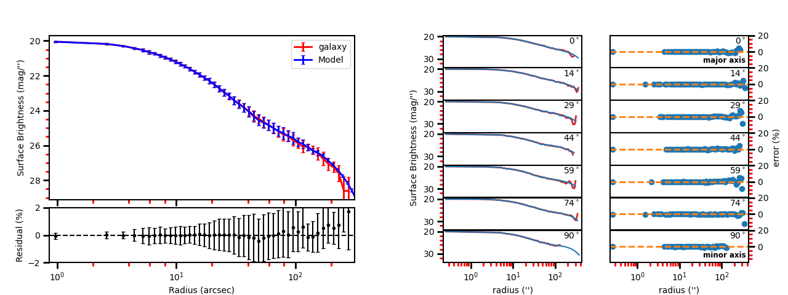
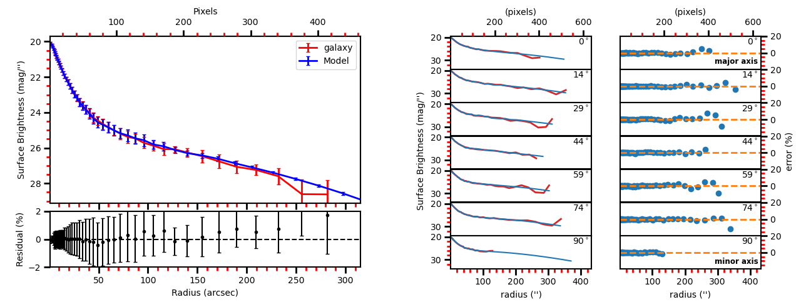

# EllipSectGalfit.py

EllipSectGalfit.py creates surface brightness profiles
for galaxy and galfit model from the galfit output: galfit.XX. 
See peng et al. (2002). It also creates multiple surface brightness 
plots for separate angles.  

**Code: [EllipSectGalfit.py](../EllipSectGalfit.py)**

This is a "quick" substitute for IRAF's ellipse
routine. It creates an "ellipse" profile of the galaxy
and model.

The options to run the code in the terminal (or ipython) are:

```
 ./EllipSectGalfit.py [GALFITOutputFile] [--logx] [--q AxisRatio] [--pa PositionAngle] [--sub] [--pix] [--ranx Value] [--ranx/y Value] [--grid] [--dpi Value] [--noplot] [--out]
 ```

Examples: 

 ./EllipSectGalfit.py galfit.01 --logx

*or* 

 ./EllipSectGalfit.py galfit.02 --q 0.35 --pa 60 --sub


## Options 

**GALFITOutputFile**: GALFIT output file  (e.g. galfit.01)

**logx**: plots X-axis as logarithm

**q**: axis ratio value. If ignored, it takes the one from the last component in GALFITOutputFile.

**pa**: position angle value (same as GALFIT). If ignored, it takes the one 
from the last component in GALFITOutputFile.

**sub**: plots include the model subcomponents

**pix**: plots the top of x-axis in pixels

**ranx**: constant that multiplies the range of the x axis to increase/decrease *or* 
it can be used as xmin-xmax to change range

**rany**: constant that multiplies the range of the y axis to increase/decrease it
*or* it can be used as ymin-ymax to change range.

**noplot**: the code creates images but do not display them.

**grid**: display a grid in the plot

**dpi**: dots per inch value to increase/decrease resolution.

**out**: creates output file from the data of the plot. 


## Notes

* EllipSectGalfit already uses the mask image (option "*F*" GALFIT) only if this
    is a **FITS** image. In case your mask is an *ASCII* file, you can convert it to **FITS**
    using the [xy2fits.py](xy2fits.md) tool.


* EllipSectGalfit uses axis ratio (*q*) and position angle (*pa*) to create a *grid* 
    using the function *sectors_photometry* from the *mgefit* library. Unlike IRAF's Ellipse, 
    *q* and *pa* are fixed through radius. See the two images below: 

    
    

    For this reason, errors given by this program are expected to 
    be greater than those coming from IRAF's ellipse since EllipSectGalfit 
    leaves the axis ratio fixed for the whole radio. While, on the other hand, IRAF's ellipse
    can change axis ratio and angular position for each isophote.

* Be sure to run this code in the same path that you run GALFIT. 

* Since EllipSectGalfit reads the "*B*" option of galfit.XX file, this
    must be the last GALFIT fit. 

* The angles shown in the multi-plot are measured from the galaxy's major axis.
    They are not measured from the Y-axis as it is the case in GALFIT.

* In order for the program to detect the components, they must have the same 
    center (x,y).

## Examples

See the examples below for an elliptical galaxy that was fitted 
with 7 gaussians (images for this galaxy are displayed above). 

* Example 1: 
    ./EllipSectGalfit.py galfit.46 

    
    

* Example 2:
    ./EllipSectGalfit.py galfit.46 --logx

    
    

* Example 3: 
    ./EllipSectGalfit.py galfit.46 --sub
    (displays the 7 gaussians)

    
    

* Example 4: 
    ./EllipSectGalfit.py galfit.46 --pix
    (put pixels marks on top x-axis)

    
    

* Example 5: 
    ./EllipSectGalfit.py galfit.46 --ranx 0.5 
    (range in x-axis is decreased 50%)

    
    

* Example 6: 
    ./EllipSectGalfit.py galfit.46 --rany 2 
    (range in y-axis doubled)

    
    

* Example 7: 
    ./EllipSectGalfit.py galfit.46 --ranx 1-50 
    (x-axis ranges from 1 to 50)

    
    

* Example 8: 
    ./EllipSectGalfit.py galfit.46 --grid 

    
    


**EllipSectGalfit.py** uses the mgefit library which is
described in Cappellari, MNRAS, 333, 400 (2002).

Check my others GALFIT tools [here](../README.md)
 

