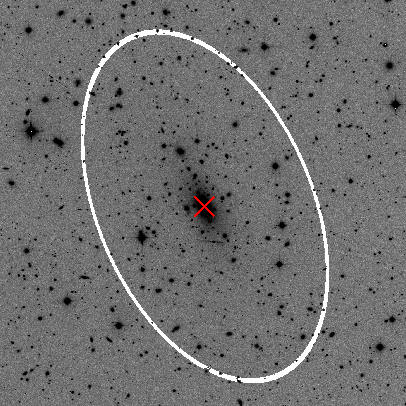

.. contents::
   :depth: 3
..

--------------

**EllipSect: How to use**
=========================

|DOI|

EllipSect creates surface brightness profiles and extracts other
photometric data from the GALFIT output peng et al. (2002).

**OPTIONS**
-----------

You only need the GALFIT output file to run it. All the information
EllipSect needs is in this file. However, there are some options
available to use.

The options are:

::

   
      
    ellipsect [-h] [-lx] [-cp] [-px] [-g] [-sb] [-np] [-ph] [-ci] [-nn] [-gsky] [-rsky] [-snr]
                 [-re] [-r90] [-r95] [-k] [-gx] [-asp] [-t] [-q AXISRAT] [-pa POSANGLE]
                 [-rx RANX RANX] [-ry RANY RANY] [-dpi DOTSINCH] [-ml MINLEVEL] [-sc SECTORS]
                 [-ob OBJECT] [-f FILTER] [-dm DISTMOD] [-mc MAGCOR] [-sk SCALEKPC] [-sd SBDIM]
                 [-md MODEL] [-sky SKY] [-ned NED] [-ri RADINIT] [-srm SKYRADMAX] [-skb SKYBOX]
                 [-skn SKYNUM] [-skw SKYWIDTH] [-distm DISTMAX] [-fw FWHM] [-br BRIGHTNESS]
                 [-co CONTRAST] [-cm CMAP] [-nc NUMCOMP] [-ae AEXT] [-hc HCONST] [-om OMEGAM]
                 [-ov OMEGAV]
                 GalFile

Below is an explanation of each parameter:

**Main input parameters**
-------------------------

**GalFile**: GALFIT output file (e.g. galfit.01). This **must** be
the last GALFIT run. In other words, if there are two files: galfit.01
and galfit.02, the one you need is galfit.02

**help**: Help menu

**logx**: plots X-axis as logarithm

**q**: axis ratio value. If ignored, it takes the one from the last
component in GALFIT_File.

**pa**: position angle value (same as GALFIT). If ignored, it takes the
one from the last component in GALFIT_File.

**comp**: plots include the individual model components

**pix**: adds pixels units to the top of x-axis.

**ranx**: set the range to xmin-xmax .

**rany**: set the range to ymin-ymax .

**noplot**: the code creates images but do not display them.

**grid**: display a grid in the plot

**dpi**: dots per inch value to increase/decrease resolution.

**sbout**: Creates output file containing the surface brightness
profiles.

**galax**: Only the galaxy surface brightness is plotted.

**effrad** Draw a vertical line indicating the effective radius
**rad90**  Draw a vertical line indicating the 90% of total light
**rad95**  Draw a vertical line indicating the 95% of total light

**Photometric output options**
------------------------------

**phot**: Compute photometry. Check the variables created in output
file.

The below options are used only if ‘phot’ is enabled:

**snr**: Creates a signal to noise image. This is created dividing the
galaxy image with the sigma image created by GALFIT

**object**: used for ‘phot’ to search in NED. For instance, if you are
looking for photometry data for galaxy m51, then used as “-object m51”
the same name that you will used to search in NED.

**filter**: used for ‘phot’ to indicate band for NED. If you need
galactic correction for B filter then used as “-filter B”. Band “R” is
the default option.

Any of the following options disabled the connection to NED

**noned**: it avoids to connect with NED. No luminosity nor absolute
magnitude is computed.

**distmod**: manual input for Distance Modulus.

**magcor**: manual input for Galactic Extinction.

**scalekpc**: manual input for equivalence of ’’/kiloparsec.

**sbdim**: manual input for surface brightness dimming.

**Advanced**
------------

**minlevel**: Parameter given directly to sectors_photometry. Ellipse
radius stops when it founds this value (counts). Check
sectors_photometry manual

**sectors**: parameter given directly to sectors_photometry. It Divides
the ellipse in ‘sectors’ Check sectors_photometry manual

**checkimg**: save the images used in sectors_photometry for individual
components

**model**: User can introduce his/her own model image. SNR quantities
will be inaccurate for this option.

**keep**: Use existing ‘-comp.fits’ file to compute subcomponents.

**ned**: User can introduce his/her own ned xml file.

**fwhm**: Parameter used to compute the PSF’s Area to estimate BICres.
It is the Bayesian Information Criterion but instead of using pixels, it
used PSF’s Area (number of elements of resolution). Default = 2 pixels

**Background Sky**
------------------

**sky**: User can introduce his/her own sky value. This will be used
instead of the one readed in galfit.XX

EllipSect can estimate the background sky independently of the one
fitted by GALFIT. The computed sky value will **not** be used for the
final computations of the **phot** option. The purpose is that the
computed sky can serve as a reference for the user. It is expected that
this value is *close* to the calculated by GALFIT, but it could vary for
different entries of the parameters.

The script uses the information of galfit.XX file to make its
computations.

EllipSect offers two ways to compute the background sky:

1) **Gradient method**. The sky value will be computed in an ellipse
   ring around the main target. The ring will increase until a the
   gradient of the sky of several ellipses becomes positive.

gradsky: computes sky using the gradient method skywidth: width of the
ring (in major axis). Default = 20 pix skyinit: (optional) For gradsky
it is where the program starts to compute the gradient.

To see the ring, a file with name outfile-ring.fits will be created.

2) **Random box method**. Computes the sky using random boxes. A number
   of *skynum* boxes of size *skybox* will appear in random positions
   around the main target.

randsky: computes the sky averaging random boxes. skynit: for randsky,
it creates a mask for the main target using this radio. skyRadmax: for
randsky only, maximum radius from main target where randbox can be
selected. Default: edge of the image skynum: Number of boxes used in
randsky. Default = 20 skybox: pixel size of the box for randsky. Default
= 20

**Residuals subplot**
---------------------

The residual plot is created from the observed and model surface
brightness profiles. It takes the x- and y-arrays from the observed and
model profiles (including their errors). When the lengths of the
y-arrays of the observed and model profiles are different, an
interpolation is made in order to have both with the same length to do
the following mathematical operations: residual = ((ydata -
ymodel)/ydata)\ *100 err = ((ymodel/ydata\ 2)\ 2)* ydata_error^2 +
((1/ydata)^2) \* ymodel_error^2 err = np.sqrt(err)*100 Note that both
formulas are multiplied by 100 in order to show them in percentage.
\__\_

**Examples**
------------

-  Displays the help menu:

   ::

        ellipsect --help

Check the short versions of the arguments when help is displayed.

--------------

EllipSect use the axis ratio and position angular to construct an
ellipse centered at the galaxy to extract the photometric counts data
(actually, this is done by the function sectors_photometry from MGE, see
Cappellari, MNRAS, 333, 400 (2002)). This is directly taken from the
GALFIT File taking that info from the last component (in case it has
more than one). In case, you want to change axis ratio and angular
posititon you can enter that data manually:

-  To introduce an axis ratio of 0.35 and position angular of 60
   (measured from Y-axis):

::

        ellipsect galfit.02 -q 0.35 -pa 60 

**Plot Examples**
~~~~~~~~~~~~~~~~~

See the examples below for an elliptical galaxy that was fitted with 7
gaussians (images for this galaxy are displayed in **Notes** section).

-  Simple plot example:

   ::

        ellipsect galfit.46 

   .. figure:: ../img/A85.def.png
      :alt: A85

-  Displays the X-axis as log:

::

       ellipsect galfit.46 --logx

-  Include the individual model components into the plot:

   ::

        ellipsect galfit.46 --comp

   (displays the 7 gaussians)

   .. figure:: ../img/A85.comp.png
      :alt: A85

-  Insert pixels units in the top X-axis:

   ::

        ellipsect galfit.46 --pix

   .. figure:: ../img/A85.pix.png
      :alt: A85

-  X-axis range vary from 1 to 50:

   ::

        ellipsect galfit.46 -ranx 1 50 

   .. figure:: ../img/A85.ranx2.png
      :alt: A85

-  Use grid on plot and increase resolution to 300 dots per inch:

::

      ellipsect galfit.46 --grid --dpi 300 

-  Same as above but popup window does not appear. Plot files are
   directly saved in directory:

::

       ellipsect galfit.46 --grid --dpi 300 --noplot 

-  If the user desires to create their own plots, ‘sbout’ option will
   save the surface brightness data of the plots into a file:

::

       ellipsect galfit.46 --sbout

EllipSect can also save the surface brightness data for individual
components in separated files:

::

       ellipsect galfit.46 --comp --sbout 

-  You can change the contrast and brightness of the cube image with the -co
   and -br options respectivelly:

::

       ellipsect galfit.46 --co 0.4 -br 22

-  Also with the -cp option it display the ellipse of each component on
   the galaxy panel of the cube image:

::

      ellipsect galfit.46 --co 0.5 -cp

**Note**: the ellipse’s axis ratio corresponds to the radius of the “4)”
component. If the component is a Sersic model, then it is the
effective radius (pix); if it is a gaussian, then it is the FWHM (pix),
and so on.

**Phot Examples**
~~~~~~~~~~~~~~~~~

-  | *EllipSect* can calculate additional info besides the ones that are
     already included in the galfit.XX or fit.log files.
   | Those variables are intended to help the user to have a quick
     reference of the model and decide to modify the model or increase
     the number of components.

   Such output variables have to be taken with caution and they always
   have to be verified for the user before to include them in their
   final work.

   The output photometry variables include: Absolute Magnitude,
   luminosity, Flux, total apparent magnitude, Bulge to Total Ratio,
   Tidal, :math:`\Chi_\nu` within the sectors ellipse, Bumpiness, Signal
   to Noise Ratio, Akaike Information Criterion, Bayesian Information
   Criterion, mean surface brightness, percentage of total light per
   individual component, radius at 90% of light (for Sersic components
   only).

   If you want to check the ellipse where all those photometric
   variables were computed, then check the file created "*-check.fits".

   Those variables are stored in a single file when the following
   command is executed:

   ::

       ellipsect galfit.46 --phot

-  *phot* option connects to NED (NASA/IPAC Extragalactic Database) to
   download info of Galactic Extinction, distance modulus, surface
   brightness dimming, etc. to compute Absolute Magnitude, luminosity
   and other variables. To do this, EllipSect looks for name of the
   galaxy (as it is searched in NED) and wavelength band in the header.
   If that info is not in the header, the user can introduce the band
   and object name as it is shown in the next example for galaxy messier
   51 in the band B:

::

       ellipsect galfit.14 --phot --object m51 --filter B

-  If the user wants to see a Signal to Noise image of the data, use the
   next command:

   ::

      ellipsect galfit.14 --phot --snr

-  If for some reason the user does not want to connect to NED use the
   following option:

::

     ellipsect galfit.14 --phot --noned

take into account that Luminosity and Absolute magnitud will not be
computed

-  EllipSect allows to enter manually the NED info. For example, the
   next command introduce a distance modulus of 10, galactic extinction
   of 0.3, "/kpc of 1.3 and surface brightness dimming of 0.3.

::

      ellipsect galfit.10 --phot --distmod 10 --magcor 0.3 --scalekpc 1.3 --sbdim .3

Take into account that any of this options will avoid the connection to
NED.

EllipSect does not correct by K-correction.

**Advanced Examples**
~~~~~~~~~~~~~~~~~~~~~

-  model option allows the user to introduce his own model image for
   analysis. EllipSect will use this image instead of the one created by
   GALFIT output. If -phot option is enabled, SNR quantities will be
   inaccurate.

::

      ellipsect galfit.14 --model model.fits

-  sky option allows the user to introduce his/her own sky value to
   subtract it from the galaxy and the model images. User must know what
   he/she is doing because otherwise EllipSect will produce wrong
   outputs.

::

      ellipsect galfit.01 --sky 300

--------------

-  The following options requires that the user has already experienced
   with the *sectors_photometry* function of the mge library. The inputs
   to the parameters below are directly given to the
   *sectors_photometry* function

   minlevel is a parameter that is given directly to
   *sectors_photometry*. It indicates when the functions stops. For
   example, the following command tells to *sectors_photometry* that
   stops when the sky is 0.

::

       ellipsect galfit.14 --minlevel 0

Note: Galfit sky parameter is already removed from image before the call
to *sectors_photometry*

-  sectors option is another parameter that is given directly to
   *sectors_photometry*. It tells the function in how many sectors it
   should divide. *sectors_photometry* use four-fold symmetry.

::

       ellipsect galfit.14 --sectors 19

-  checkimg will create images used by *sectors_photometry* to check how
   this function was used on the individual model components. The images
   names will start with ‘C’ followed by the component number.

   Use it with the ‘comp’ option:

::

       ellipsect galfit.14 --comp --checkimg

**Sky calculation Example**
~~~~~~~~~~~~~~~~~~~~~~~~~~~

-  Computes the sky using the gradient method

::

       ellipsect galfit.06 --gradsky

After computing sky, a outname-ring.fits will be created to check the
ring where the sky was computed:

--------------

**Run the example**
-------------------

Check the `example <example>`__ to test it by yourself.

--------------

**Another way to use it**
-------------------------

If you want to use EllipSect inside your own python script, you can call
it in the following way:

::

       from ellipsect import ArgParsing 
       from ellipsect import SectorsGalfit

       #put all the argument parsing in a list:
       args=['galfit.01','--logx', '--phot','--noplot']

       parser_args = ArgParsing(args)

       photapi = SectorsGalfit(parser_args)

       print("Akaike Criterion: ",photapi.AICrit)
       print("Bulge to Total: ",photapi.BulgeToTotal)

In the previous example, the option “-phot” is necessary in argv to
produce an output.

To check all the output variables check:

`Output variables <api.rst>`__

--------------

**Notes** (read this please)
----------------------------

-  EllipSect works for GALFIT version > *3.0.7*

-  This program is not like other one-dimensional surface brightness
   codes. It does not do any fit; the model fit was already done by
   GALFIT. It only extract that information to make the plots.

-  EllipSect uses the mask image (option “*F*” GALFIT) if this is a
   **FITS** image. In case your mask is an *ASCII* file, EllipSect
   convert it to **FITS** using the same code found in
   `xy2fits.py <https://github.com/canorve/GALFITools/blob/master/docs/xy2fits.md>`__
   tool.

-  EllipSect uses axis ratio (*q*) and position angle (*pa*) to create
   an “ellipse” *grid* using the function *sectors_photometry* from the
   *mgefit* library. Unlike IRAF’s Ellipse, *q* and *pa* are fixed
   through radius. See the images below:

   .. figure:: ../img/A85.png
      :alt: A85 gal

      A85 gal

   For this reason, errors are expected to be greater than those coming
   from IRAF’s ellipse since EllipSect averages errors for different
   isophotes. While, on the other hand, IRAF’s ellipse can change axis
   ratio and angular position for each isophote.

   This is how mgefit *sectors_photometry* returns the counts data and,
   unless I write my own code, I can’t change that.

-  Be sure to run this code in the same path that you run GALFIT.

-  Since EllipSect reads the “*B*” option of galfit.XX file, this must
   be the **last** GALFIT fit.

-  The angles shown in the multi-plot are measured from the galaxy’s
   major axis. They are **not** measured from the Y-axis.

-  In order for the program to detect the components, they must share
   the same center (there is a 10 pixel distance tolerance though). This
   allows that GALFIT can use other components to be used as masks for
   nearby galaxies. *EllipSect* does not take them into account for the
   plots.

-  For the comp option, It could be some small differences between the
   angle shown in the top right corner and the one from each component.
   This is because *sectors_photometry* is applied different for
   individual components and the galaxy itself. They are at different
   angles. To see the real angle which the component is measured check
   the output file at that angle with the *–sbout* option

-  EllipSect is not adapted for the GALFIT Fourier modes

-  If you fit different surface brightness models for the same galaxy,
   you will notice that (sometimes) the surface brightness of the galaxy
   slightly vary for the different model fits. This will give you the
   impression that there is something wrong with the code, but as
   explained above, the photometric data is extracted from an ellipse
   centered at the galaxy. The photometry will be different if different
   model fits have different ellipse parameters. To correct for this
   “problem”, manually provide the same axis ratio and position angle
   for the fit models you use for the same galaxy. See the first example
   of this page.

.. |DOI| image:: https://zenodo.org/badge/282223217.svg
   :target: https://zenodo.org/badge/latestdoi/282223217
